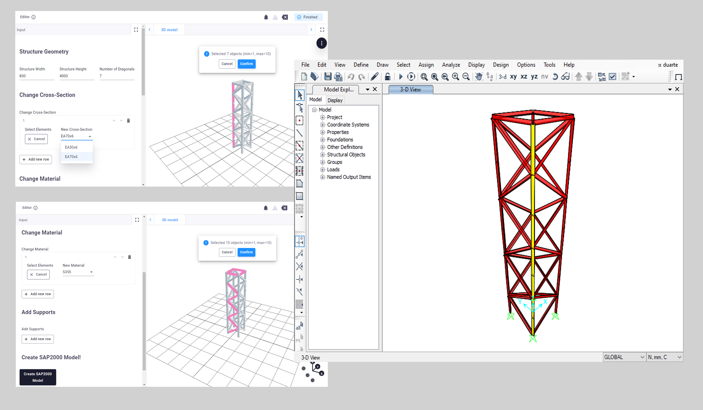

## VIKTOR - SAP2000 Integration

This app integrates SAP2000 with the Viktor platform, allowing users to create and visualize parametric models directly in SAP2000.

## Features

- **Parametric Frame Geometry**: Define and visualize frame geometry with customizable dimensions.
- **SAP2000 Model Creation**: Generate a new SAP2000 model with specified parameters like height, width, and the number of diagonals.
- **Material Assignment**: Automatically assigns concrete material properties to the generated frame.
- **3D Visualization**: Render the frame geometry in a 3D view within the Viktor platform.

## Requirements

- Python 3.x
- `viktor` package
- `pywin32` package for SAP2000 COM API integration
- SAP2000 version 25 installed

## Notes
Ensure SAP2000 is installed and accessible at the default path:
   `C:\Program Files\Computers and Structures\SAP2000 25\SAP2000.exe`

- If running within the Viktor platform, ensure COM is initialized using `pythoncom.CoInitialize()` in the app code.

## Follow for More

- Connect with me on [LinkedIn](https://www.linkedin.com/in/alejandro-duarte-vendries-955778127/).
